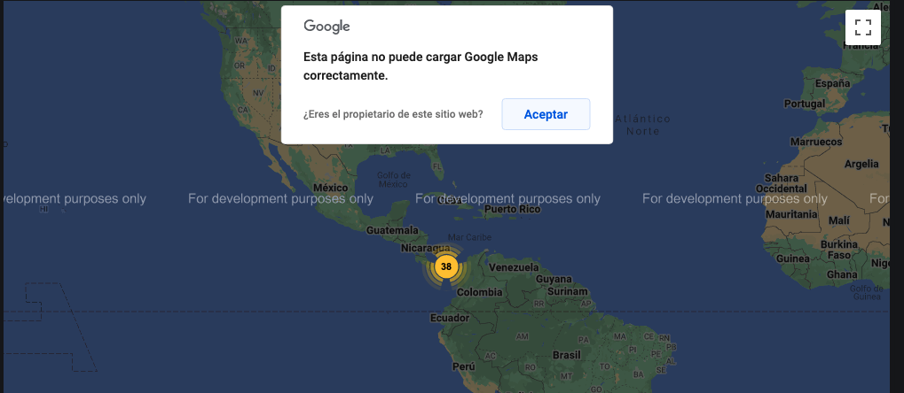

# Kamerka (Ultimate Internet of Things/Industrial Control Systems reconnaissance tool)

En entradas anteriores hablamos un poco sobre los Industrial Control System utilizando Shodan y explicamos las fases del [CyberKillChain](https://blog.toadsec.io/2022/12/08/attacking-ics.html), en esta ocasión vamos a continuar con el reconocimiento utilizando una herramienta poderosa llamada [Kamerka](https://kamerka.io/) y desarrollada [woj-ciech](https://github.com/woj-ciech) la importancia de esta herramienta en lugar de utilizar solamente shodan es la facilidad que tiene al contar con consultas prefabricadas y solo debemos seleccionar la categoría que deseamos probar. 

Existe una versión ligera que podemos acceder en https://lite.kamerka.io/, no obstante no podemos personalizar las búsquedas.

Entre sus Características encontramos

* Más de 100 dispositivos de ICS
* Sección de gallerias categorizadas 
* Mapas interactivos con google maps
* Soporte de google street view
* Altamente configurable para pruebas con queries o exploits
* Soporte para Escaneaos de map en formato XML
* Etc.

##### Requerimientos

* [Google Maps API](https://developers.google.com/maps/documentation/embed/get-api-key) 
* Un VPS con 2 vcpu y 8 Gib de memoria
* Recordar restringir el uso del api a los its del VPS 
* Cuenta de shodan académica o pagada
* Opcional WHOISXML and Binary Edge API
* No habilitar el modo debug si esta en producción

##### 1. Instalación 

Clonamos el repositorio a nuestro VPS

`git clone https://github.com/woj-ciech/Kamerka-GUI.git`


Debemos agregar las api en el archivo **keys.json**


Utilizaremos el editor de nuestra preferencia y reemplazamos donde corresponde las API (Google Maps y Shodan)


Instalaremos los dependencias con pip3 sino esta instalado lo instalamos en conjunto con las demás requerimientos

```shell
apt install python3-pip -y
pip3 install -r requirements.txt
apt-get install redis redis-server -y
```


Ejecutamos los siguientes comando en orden

```shell
python3 manage.py makemigrations
```


```shell
python3 manage.py migrate
```


El siguiente comando iniciara el servidor de Kamerka por lo que debemos dejarlo en ejecución y utilizamos otra ventana o lo ponemos en el background

```shell
python3 manage.py runserver
```


**Nota: **Si observamos el puerto utilizado es el 8000 debemos modificar los settings de Kamerka para permitir el acceso a ese puerto y abrir en  nuestro proveedor de cloud o bajamos el puerto utilizando un port fowarding

Nosotros vamos a utilizar un port forwarding

`ssh -L:8000:localhost:8000 jam620@172.177.5.32`


Por último debemos a implementar [Celery](https://docs.celeryq.dev/en/stable/userguide/workers.html)

`celery  -A kamerka worker --loglevel=info`


2. ##### Búsqueda de ICS

Ahora vamos a realizar la búsqueda de Modbus  y otros protocolos y chicheamos en search


Una vez termine de realizar la consulta debemos ver lo siguiente, mientras se realiza la búsqueda en algunas ocasiones no se actualiza inmediamamente 


Una vez se termine de actualizar y realizar la búsqueda nos debe salir algo como esto 


A la izquierda del menu en search podemos desplegar el resultado en una vista de tablas


Para ver el Mapa seleccionamos el menu **Maps** al lado izquierdo, como observamos hay 38 resultados



Podemos seleccionar el punto y nos despliega los ips y el tipo de ICS


De igual manera podemos acercarnos y vemos las ubicaciones en las diferentes provincias


Al seleccionar un punto podemos ver más datos, donde si añadimos otros apis podemos ver información relacionada a twitter o imágenes de flicker


Además que nos proporciona un resumen tipo intel


Podemos realizar un scaneo con nmap, si lo tenemos instalado


Para finalizar la herramienta para hacer un reconocimiento automatizado es recomendable, además podemos observar que cuenta con una interfaz amigable, podemos realizar búsquedas con queries predefinidos o agregarles los nuestros. Por último recordar no exponer en producción sin antes analizar el  código es un deber de todos.


